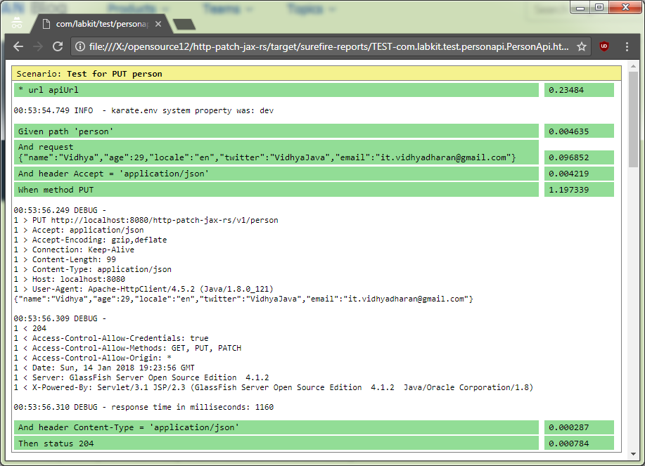
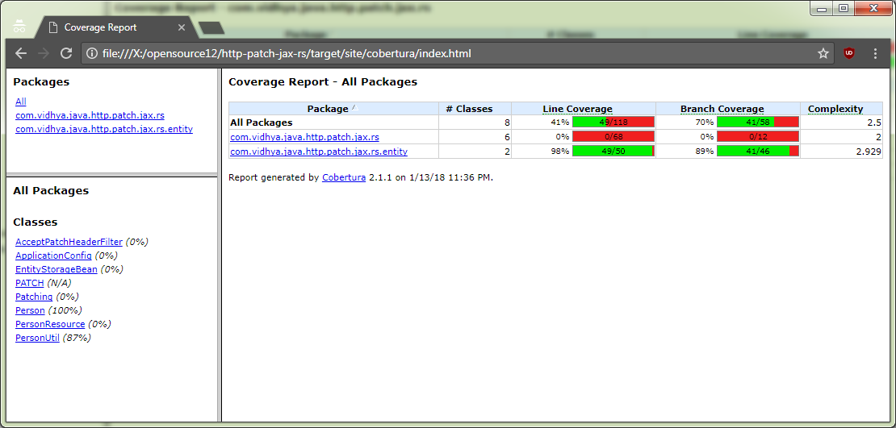
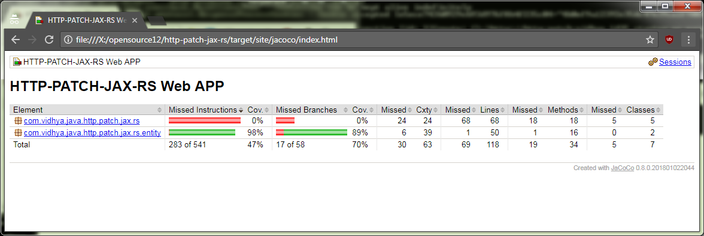

# Person API [](https://travis-ci.org/vidhya03/http-patch-jax-rs) [](https://codecov.io/gh/vidhya03/http-patch-jax-rs) [](https://github.com/vidhya03/http-patch-jax-rs/blob/master/LICENSE.md)
A simple HTTP REST service  web application also called as Person API

# Heads up
- This project has been hosted in Openshift
- Access this project @ http://http-patch-vidhya.1d35.starter-us-east-1.openshiftapps.com/
- Swagger for this API [http-patch-demo-swagger.json](src/main/resources/http-patch-demo-swagger.json)
- [Deeplink](https://raw.githubusercontent.com/vidhya03/http-patch-jax-rs/master/src/main/resources/http-patch-demo-swagger.json) for direct import
- Try this Person API at http://try.personapi.labkit.in/

# Development
- checkout
 ```  
   git clone https://github.com/vidhya03/http-patch-jax-rs.git
```
- compile
```
  cd  http-patch-jax-rs.git
  mvn compile
```

# Rest API testing using karate
- To run test against production
```
  mvn test
```
- To run test against local deployment
```
  mvn test -dkarate.env=dev
```
and the HTML reports would be output to /target/surefire-reports/TEST-com.labkit.test.personapi.PersonApi.html 
 
# Code Coverage using Cobertura
- To run test and perform code coverage
```
  mvn cobertura:cobertura
```
and the HTML reports would be output to target/site/cobertura/index.html
 
# Code Coverage using Jacoco
- To run test and perform code coverage
```
  mvn clean test -Pcoverage
```
and the HTML reports would be output to target/site/jacoco/index.html
 

# License
* [MIT License](https://github.com/vidhya03/http-patch-jax-rs/blob/master/LICENSE.md)